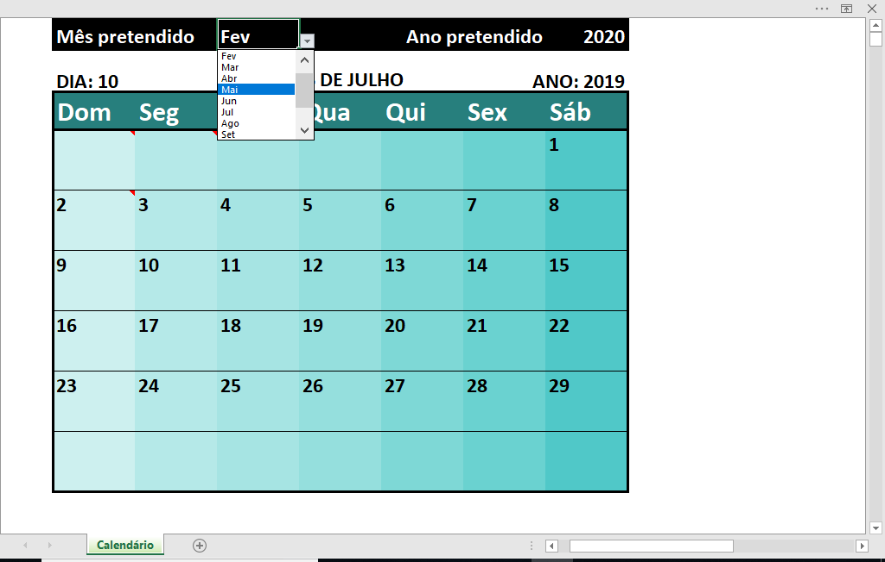

# Planilhas

### Um repo para planilhas aleatórias. 

* **Marketplace Jo.xlsm**
    * Controle interno de um mercado ([subs usadas](/VBA_subs/Marketplace%20Jo.vba)).
    
    
    
    
* **My Calendar.xlsx**
	* Usa as fórmulas **=SE()**, **=TEXTO()** e **=MOD()**
	* Com ano bissexto
	 
* [**VBA_subs**](/VBA_subs/)
	* Pequenos códigos para conceito  
  
_a senha é 123_
